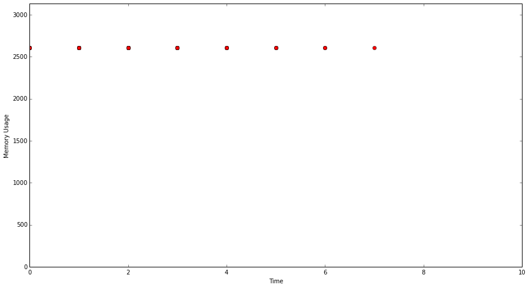

% Very brief introduction to "ownership" in programming languages

Sydney Rust Meetup, April 2015, Robert Fink

# Ownership

> "At its core, ownership is about resources."

<hr class="pause" />

> "Rust has a focus on safety and speed. [...] Ownership is how Rust achieves its largest goal, memory safety."

<hr class="pause" />

> "Rust's secret weapon is ownership"

<hr class="pause" />

> "This is one of Rust's most unique and compelling features [...]"

<hr class="pause" />

> "Historically, systems programming languages require you to track these allocations, deallocations, and handles
yourself."

<hr class="pause" />

> "Uh oh!"

<div class="attribution"><a href="http://doc.rust-lang.org/1.0.0-beta/book/ownership.html">Rust Book</a></div>
<div class="attribution"><a href="http://blog.rust-lang.org/2015/04/10/Fearless-Concurrency.html">Rust Blog: Fearless Concurrency</a></div>


# Upsides of getting ownership right

* **Code quality**
* Correctness
* Stability and determinism
* Speed

# Code quality
> Claim: In the long run, lacking awareness of ownership gives rise to both buggy and unmaintainable code.

<hr class="pause" />

Proof by example...

<hr class="pause" />

## Background: Ownership in Java and C++
- (Originally, ) neither Java nor C++ have a language feature that supports ownership
- [As of C++11, std::shared_ptr, std::unique_ptr and friends]
- [In C++: const modifier gives rise to immutable borrowing]
- "Everyone owns everything" or "Nobody owns anything"
- Use comments to indicate ownership

# Example: A Java database backend
```java
class DatabaseBackend implements AutoCloseable {
  private final Connection db;

  public DatabaseBackend(Connection db) {
    this.db = db;
  }

  public void write(Object o) {
    db.store(o);
  }

  @Override
  public close() {
    db.shutdown();
  }
}
```

<hr class="pause" />

```java
// Novice programmer Alex leaks a DB connection.
Connection db = createConnection();
DatabaseBackend backend = new DatabaseBackend(db);
backend.write(something);
```

<hr class="pause" />

```java
// Shannon closes the db connection but not the backend.
Connection db = createConnection();
DatabaseBackend backend = new DatabaseBackend(db);
backend.write(something);
db.shutdown();
```

<hr class="pause" />

```java
// Peter closes the backend.
Connection db = createConnection();
DatabaseBackend backend = new DatabaseBackend(db);
backend.write(something);
backend.close(); // also closes db.
```

<hr class="pause" />

```java
// Java7 guru Andy has heard of try-with-resources.
Connection db = createConnection();
try (DatabaseBackend  backend = new DatabaseBackend(db)) {
  backend.write(something);
}
db.close();
```

# Example: A Java database backend

Now assume the library author improves error handling.

```java
class DatabaseBackend implements AutoCloseable {
  private final Connection db;

  public DatabaseBackend(Connection db) {
    this.db = db;
  }

  public void write(Object o) {
    db.write(o);
  }

  @Override
  public close() {
    if (db.isShutdown()) {
      throw new IOException("DB already closed");
    }
    db.shutdown();
  }
}
```

<hr class="pause" />

```java
// This change breaks Andy's code.
Connection db = createConnection();
try (DatabaseBackend  backend = new DatabaseBackend(db)) {
  backend.write(something);
}
db.close(); // throws
```

<hr class="pause" />

## Andy's work-around: IoUtils.closeQuietly()
```java
public static void closeQuietly(Closeable closeable) {
  try {
    if (closeable != null) {
      closeable.close();
    }
  } catch (IOException ioe) {
    // ignore
  }
}
```

<hr class="pause" />

```java
Connection db = createConnection();
try (DatabaseBackend  backend = new DatabaseBackend(db)) {
  backend.write(something);
}
IoUtils.closeQuietly(db);
```

<hr class="pause" />

## Problems with this work-around 

- Ownership remains unclear
- Impossible to understand who owns what
- Impossible to understand which code is dead/important/redundant

# "Solution": Clarify ownership in comments.

```java
class DatabaseBackend implements AutoCloseable {
  private final Connection db; // owned

  /** Creates new backend, takes ownership of db which
    * should never be closed by a caller.
    */
  public DatabaseBackend(Connection db) {
    this.db = db;
  }

  @Override
  public close() {
    db.shutdown();
  }
}
```

<hr class="pause" />

## Example: AppendableWriter from Google's Guava

```txt
/**
 * Writer that places all output on an {@link Appendable}
 * target. If the target is {@link Flushable} or
 * {@link Closeable}, flush()es and close()s will also
 * be delegated to the target.
 */
class AppendableWriter { ... }
```

# Upsides of getting ownership right

* Code quality
* **Correctness**
* Stability and determinism
* Speed

# Example: A simple Web server

- Multithreaded
- Standard consumer/producer pattern: ConnectionHandler accepts network connections, RequestHandler instances do the actual work.

```txt
class ConnectionHandler {
  private AsyncQueue<Request> requests;

  void loop() {
    while(true) {
      Request request = waitForRequest();
      requests.push(request);
    }
  }
}

class RequestHandler() {
  private AsyncQueue<Request> requests;

  void loop() {
    while (true) {
      Request request = requests.pop();
      handle(request);
    }
  }
}
```

# Example: A buggy Web server

```txt
class ConnectionHandler {
  private AsyncQueue<Request> requests;

  void loop() {
    while(true) {
      Request request = waitForRequest();
      requests.push(request);
      request.setHeader("DATE", DateTime.now());
    }
  }
}

class RequestHandler() {
  private AsyncQueue<Request> requests;

  void loop() {
    while (true) {
      Request request = requests.pop();
      handle(request);
    }
  }
}
```

<hr class="pause" />

## Correctness issues when ownership is unclear

### Problems
- Unclear ownership gives rise to shared mutable state
- Shared mutable state is subject to race conditions and other $badThings

### Approaches
- Mutual exclusion (comes with its own problems ... deadlocks, starvation, etc)
- Atomic operations
- Immutable objects


# Upsides of getting ownership right

* Code quality
* Correctness
* **Stability and determinism**
* **Speed**

# Back to the Web server

```java
class Request {
  long num;
  byte[] s;

  public Request(long num) {
    this.num = num;
    this.s = new byte[1000000]; // expensive.
  }
}

public class WebserverSimulator {
  public static void main(String[] args) {
    int numIterations = Integer.parseInt(args[0]);
    int bufferSize = Integer.parseInt(args[1]);

    LinkedList<Request> requests = new LinkedList<>();
    // Fill buffer, simulate workload of concurrent requests.
    for (int i = 0; i < bufferSize; ++i) {
      requests.push(new Request(i));
    }

    // For every new request, we handle one.
    for (int i = 0; i < numIterations; ++i) {
      Request request = requests.remove();
      requests.push(new Request(i));
    }
  }
}
```

# C++ memory usage

## With leaks
```c++
for (int i = 0; i < numIterations; ++i) {
  Request* request = requests.front();
  requests.pop();
  requests.push(createRequest(i));
}
```


<hr class="pause" />

## No leaks
```c++
for (int i = 0; i < numIterations; ++i) {
  Request* request = requests.front();
  requests.pop();
  delete request;
  requests.push(createRequest(i));
}
```



# Rust memory usage

## With leaks
Joking ...

<hr class="pause" />

## No leaks
```rust
for i in 0..num_iterations {
  let request = requests.pop_front();
  requests.push_back(Box::new(Request::new(i)));
}
```


# C++ execution time
## With leaks

## No leaks


# Rust execution time
## No leaks


# Java execution time
## No leaks, with Garbage Collection
```java
for (int i = 0; i < numIterations; ++i) {
  Request request = requests.remove();
  requests.push(new Request(i));
}
```

<hr class="pause" />


# Speed, stability, determinism

## Java: No ownership, garbage collector cleans up
- Writing code is dead simple
- Sacrifice: unpredictable GC overhead

## C++: Programmer manages ownership
- No static guarantees
- Run-time checks for resource de-allocation (e.g., valgrind)
- Really fast if you remember to clean up
- Else: bound to run out of memory eventually

## Rust: Compile time ownership
- Compile-time guarantees on ownership and resource de-allocation
- Really fast. (You don't need to remember to clean up.)
- Sacrifice: Learning curve, syntax overhead, simple programs are more complicated (e.g., [FizzBuzz](http://chrismorgan.info/blog/rust-fizzbuzz.html))

# Upsides of getting ownership right

I hope I could convince that getting ownership right helps to address the following issues:

* Code quality
* Correctness
* Stability and determinism
* Speed

# Links

## Ownership, borrowing, lifetimes in Rust:
- http://arthurtw.github.io/2014/11/30/rust-borrow-lifetimes.html
- http://doc.rust-lang.org/1.0.0-beta/book/ownership.html

## FizzBuzz in Rust:
- http://chrismorgan.info/blog/rust-fizzbuzz.html

## Experiments (iPython Notebook): https://github.com/uschi2000/rust-meetup-ownership-2015/tree/gh-pages/exp
